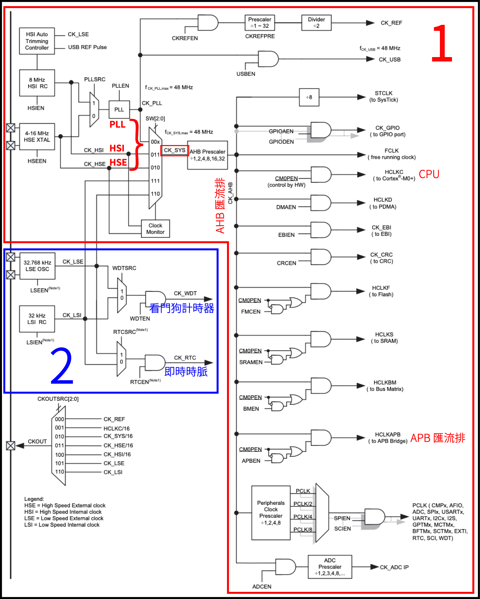
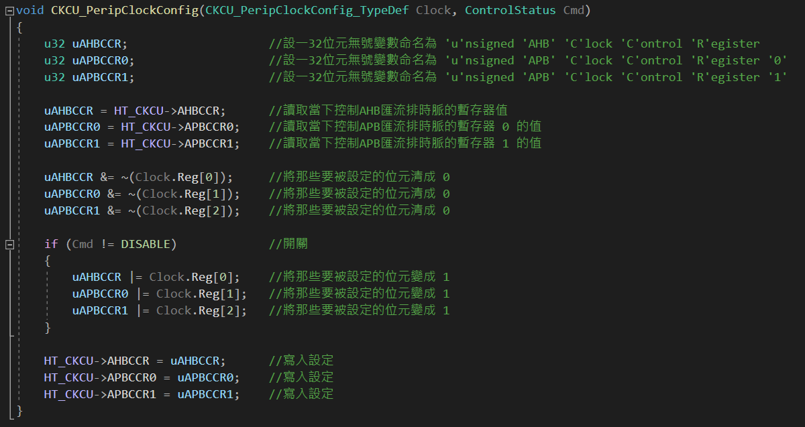

## CKCU
<!--table of content-->
<hr>
<table>
<tr>
</tr><th>第一週<br>第二週</th>
<th>第三週</th>
<th>第四週</th>
<th>第五週</th>
<th>第六週</th>
<th>第七週</th>
<th>第八週</th>
<th>第九週</th>
<th>第十週</th>
<th>...</th>
</tr>
<tr>
<td><p align="center"><a href="">README</a></p></td>
<td>
<table><tr><td>

### CKCU
&nbsp;&nbsp;&nbsp;&#9679;&nbsp;&nbsp;[前情提要](#前情提要)<br>
&nbsp;&nbsp;&nbsp;&nbsp;&nbsp;&nbsp;&nbsp;1.&nbsp;&nbsp;[設定方式](#1-設定方式)<br>


&nbsp;&nbsp;&nbsp;&#9679;&nbsp;&nbsp;[詳細講解](#詳細講解)<br>
</td></tr></table>
</td>
<td><p align="center"><a href="">GPIO<br>AFIO</a></p></td>
<td><p align="center"><a href="">EXTI<br>NVIC</a></p></td>
<td><p align="center"><a href="">BFTM</a></p></td>
<td><p align="center"><a href="">GPTM<br>MCTM</a></p></td>
<td><p align="center"><a href="">期中考</a></p></td>
<td><p align="center"><a href="">ADC</a></p></td>
<td><p align="center"><a href="">I&#0178;C<br>EEPROM</a></p></td>
<td>&nbsp;&nbsp;...&nbsp;&nbsp;</td>
</tr>
</table>
<hr>
<!--/table of content-->
<br>
<h2 align="center"><code>簡單介紹</code></h2>

### 1. 設定方式
通常範例程式裡面為了排版較好閱讀會將 CKCU 的設定移至成獨立的一個副函式名為 `CKCU_Configuration`。原先預設所有功能的 clock 都是開著的，為了效能所以會先關掉全部的然後 **需要用到什麼再開什麼**。
```c
void CKCU_Configuration(void)
{
  CKCU_PeripClockConfig_TypeDef CKCUClock = {{ 0 }};    // 將全部的 Clock 關掉
                                                        // 你要用到什麼功能就在這裡啟用它的 Clock，例如：
  CKCUClock.Bit.PC		   = 1;                         // 啟動 Port C 的 Clock
  CKCU_PeripClockConfig(CKCUClock, ENABLE);             // 最後將上面所有的設定寫入
}
```

:blue_book: 很常你添加了一個功能，比如說一個計時器然後燒錄之後發現不會動的原因是因為：***你忘記設定該功能的 Clock了！***<br>
&nbsp;&nbsp;&nbsp;&nbsp;&thinsp;&thinsp;任何功能沒有 Clock 都是不會運作的喔 ~ 所以要記得添加一個功能時都去檢查你要的功能有沒有設定好 Clock。
<br><br><br>

<!-- 
|功能|對應的程式碼|
|---|---|
|Port A| `CKCUClock.Bit.PA = 1`|
|Port B|CKCUClock.Bit.B = 1|
|Port C|CKCUClock.Bit.PC = 1|
|功能|對應的程式碼|
|功能|對應的程式碼|
|功能|對應的程式碼|
|功能|對應的程式碼|
|功能|對應的程式碼|
|功能|對應的程式碼|
 -->
<br><br>

<br><br><br><br>
<h2 align="center"><code>詳細講解</code></h2>

根據使用手冊[第82頁]("https://www.holtek.com/documents/10179/e4f15196-0041-4b58-a392-7fd45dcae509#page=82")對於時脈的介紹
> The Clock Control unit (CKCU) provides functions of high speed internal RC oscillator (HSI),
High speed external crystal oscillator (HSE), Low speed internal RC oscillator (LSI), Low speed
external crystal oscillator (LSE), Phase Lock Loop (PLL), HSE clock monitor, clock prescaler,
clock multiplexer and clock gating. The clock of AHB, APB, and CPU are derived from system
clock (CK_SYS) which can come from HSI, HSE or PLL. Watchdog Timer and Real Time Clock
(RTC) use either LSI or LSE as their clock source.

為了方便理解跟閱讀，我這裡幫你翻譯、排版好了：
<br>
> 時鐘控制器 (***C***loc***k*** ***C***ontrol ***U***nit, ***CKCU***) 提供了多種頻率和時脈功能。包括：
> * 內部高速 RC 振盪器 (***H***igh ***S***peed ***I***nternal, ***HSI***)
> * 外部高速晶體振盪器 (***H***igh ***S***peed ***E***xternal, ***HSE***)
> * 內部低速 RC 振盪器 (***L***ow ***S***peed ***I***nternal, ***LSI***)
> * 外部低速晶體振盪器 (***L***ow ***S***peed ***E***xternal, ***LSE***)
> * 鎖相迴路 (***P***hase-***L***ocked ***L***oop, ***PLL***)
> * HSE 時脈監控
> * 時脈除頻器
> * 時脈多工器
> * 時脈閘控
>
> AHB、APB 匯流排和 CPU的時脈源自於系統時脈
 (***C***LOC***K_SYS***TEM, ***CK_SYS***) ， 而系統時脈以選擇來自 HSI、HSE 或 PLL。 看門狗計時器和即時時脈 (***R***eal-***T***ime ***C***lock, ***RTC***) 使用 LSI 或 LSE 作為其時脈源。

<br>
<details>
<summary>&#128679; 施工中 &#128679;</summary>
<br>
<table>
<tr>
<td>
1. <span title="高級高性能匯流排 (Advanced High performance Bus, AHB)">AHB</span>、<span title="高級週邊匯流排 (Advanced Peripheral Bus, APB)">APB</span> 匯流排和 <span title="中央處理器 (Central Processing Unit, CPU)">CPU的時脈源自於系統時脈</span><br>
&nbsp;&nbsp;&nbsp;&nbsp;(<b><i>C</i></b>LOC<b><i>K</i></b>_<b><i>SYS</i></b>TEM, <b><i>CK_SYS</i></b>)&thinsp;，&thinsp;而系統時脈可以選<br>
&nbsp;&nbsp;&nbsp;&nbsp;擇來自 HSI、HSE 或 PLL。
<br><br><br>
2. 看門狗計時器和即時時脈 (<b><i>R</i></b>eal-<b><i>T</i></b>ime <b><i>C</i></b>lock, <b><i>RTC</i></b>)<br>
&nbsp;&nbsp;&nbsp;&nbsp;使用 LSI 或 LSE 作為其時脈源。
</td>
<td>
<br>
</td>
</tr>
</table>

```
void CKCU_PeripClockConfig(CKCU_PeripClockConfig_TypeDef Clock, ControlStatus Cmd)
{
  u32 uAHBCCR;
  u32 uAPBCCR0;
  u32 uAPBCCR1;

  uAHBCCR  = HT_CKCU->AHBCCR;
  uAPBCCR0 = HT_CKCU->APBCCR0;
  uAPBCCR1 = HT_CKCU->APBCCR1;

  uAHBCCR  &= ~(Clock.Reg[0]);
  uAPBCCR0 &= ~(Clock.Reg[1]);
  uAPBCCR1 &= ~(Clock.Reg[2]);

  if (Cmd != DISABLE)
  {
    uAHBCCR  |= Clock.Reg[0];
    uAPBCCR0 |= Clock.Reg[1];
    uAPBCCR1 |= Clock.Reg[2];
  }

  HT_CKCU->AHBCCR  = uAHBCCR;
  HT_CKCU->APBCCR0 = uAPBCCR0;
  HT_CKCU->APBCCR1 = uAPBCCR1;
}
```

<p align="center"></p>

<br>
</details>