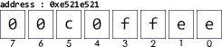

## 位元組順序

還記得 12/06 助教當時在 SPI/FLASH 課堂上提到 `"Little Endian"` 這個東西嗎？它就是一種位元組順序，根據[維基百科](https://zh.wikipedia.org/wiki/%E5%AD%97%E8%8A%82%E5%BA%8F)：
> 位元組順序，又稱端序或尾序（英語：Endianness），在電腦科學領域中，指記憶體中或在數位通訊中，組成多位元組的字的位元組的排列順序。
  

&#128204;溫馨提示：位元跟位元組不一樣哦 ~ (點我)

 
<table><tr><td>
以 <code>A = 0x00c0ffee</code> 這個值為例
 
換算成二進位是 <code>0000-0000</code> <code>1100-0000</code> <code>1111-1111</code> <code>1110-1110</code> 
&nbsp;&nbsp;&nbsp;&nbsp;&nbsp;&nbsp;&nbsp;&nbsp;&nbsp;&nbsp;&nbsp;&nbsp;&nbsp;&nbsp;&nbsp;&nbsp;&nbsp;&nbsp;&nbsp;&nbsp;&nbsp;&nbsp;&nbsp;&nbsp;&nbsp;&nbsp;&nbsp;&nbsp;&nbsp;<code>0&nbsp;&nbsp;&nbsp;&nbsp;0</code>&nbsp;&nbsp;&nbsp;&nbsp;&nbsp;&nbsp;<code>c&nbsp;&nbsp;&nbsp;&nbsp;0</code>&nbsp;&nbsp;&nbsp;&nbsp;&nbsp;&nbsp;<code>f&nbsp;&nbsp;&nbsp;&nbsp;f</code>&nbsp;&nbsp;&nbsp;&nbsp;&nbsp;&nbsp;<code>e&nbsp;&nbsp;&nbsp;&nbsp;e</code>
  

&nbsp;&nbsp;&nbsp;&nbsp;&nbsp;&nbsp;&nbsp;<b>位元</b>：一個&nbsp;&nbsp;&nbsp; `bit`&nbsp;&nbsp;&nbsp;，也就是換算成二進位時有多少個數字，A 有 `32` 個位元。 
<b>半位元組</b>：一個 `nibble`&thinsp;，也就是四個位元，A 有 <code>0</code> <code>0</code> <code>c</code> <code>0</code> <code>f</code> <code>f</code> <code>e</code> <code>e</code>，一共 <code>8</code> 個半位元組。 
&nbsp;&nbsp;&nbsp;&nbsp;<b>位元組</b>：一個 &nbsp;&nbsp;`byte`&nbsp;&nbsp;，也就是八個位元，A 有 <code>00</code> <code>c0</code> <code>ff</code> <code>ee</code>，一共 <code>4</code> 個位元組。 
</td>
</tr>
</table>

 

位元組的排列方式有兩個通用規則：
 

 
1. 一個多位的整數，按照存儲地址從低到高排序的位元組中，如果該整數的**最低**有效位元組在**最高**有效位元組的前面，則稱 `大端序 (Big-Endian)`
  

 

2. 一個多位的整數，按照存儲地址從低到高排序的位元組中，如果該整數的**最高**有效位元組在**最低**有效位元的前面組，則稱 `小端序 (Little-Endian)`
    

<table>
<tr>
<td>
<h4>有趣的知識</h4>
大小端序一詞來源於十八世紀愛爾蘭作家喬納森·斯威夫特 (Jonathan Swift) 的小說《格列佛遊記》(Gulliver's Travels)。小說中，小人國為水煮蛋該從大的一端 (Big-End) 剝開還是小的一端 (Little-End) 剝開而爭論，爭論的雙方分別被稱為「大頭派」和「小頭派」。以下是1726年關於大小端之爭歷史的描述：  

 

> 我下面要告訴你的是，Lilliput 和 Blefuscu 這兩大強國在過去36個月裡一直在苦戰。戰爭開始是由於以下的原因：我們大家都認為，吃雞蛋前，原始的方法是打破雞蛋較大的一端，可是當今國王的祖父小時候吃雞蛋，一次按傳統方法打雞蛋時碰巧將一個手指弄破了。因此他的父親，當時的國王，就下了一道敕令，命令全體臣民吃雞蛋時打破雞蛋較小的一端，違令者重罰。老百姓們對這項命令極其反感。歷史告訴我們，由此曾經發生過6次叛亂，其中一個皇帝送了命，另一個丟了王位。這些叛亂大多都是由 Blefuscu 的國王大臣們煽動起來的。叛亂平息後，流亡的人總是逃到那個帝國去尋求避難。據估計，先後幾次有11000人情願受死也不肯去打破雞蛋較小的一端。關於這一爭端，曾出版過幾百本大部著作，不過大頭派的書一直是受禁的，法律也規定該派任何人不得做官。」
> 
—— 《格列夫遊記》 第一卷第4章

 
1980年，丹尼．科恩 (Danny Cohen) ，一位網絡協議的早期開發者，在其著名的論文 <a href="https://www.ietf.org/rfc/ien/ien137.txt">"On Holy Wars and a Plea for Peace"</a> 中，為平息一場關於位元組該以什麼樣的順序傳送的爭論，而第一次引用了該詞。  
<pre>
<b>大端序</b>，從最高有效位元組看過去就像蛋從大的一端 (Big-End) 剝開，稱作 <b><i>Big-End</i></b>ian
<b>小端序</b>，從最小有效位元組看過去就像蛋從小的一端 (Little-End) 剝開，稱作 <b><i>Little-End</i></b>ian
</pre>

</td>
</tr>
</table>
 

   

&#128679; 施工中 &#128679;

&#128204;溫馨提示：16 進位跟 2 進位轉換不過來？ (點我)

 

 

<del>
一般認為 Big-Endian 是比較 **直觀** 的，舉例來說： 
今天有一組 8 位元地址 `0xe521e521` 要放進這樣一筆資料 `0x00c0ffee` ，你會怎麼放？ 如果你是這樣想的話，這就是 Big-Endian：
  
 

如果是 Little-Endian 的話會是像這樣：
  
 
 
|注意喔 ~ Big-Endian 轉換成 Little-Endian 不是以 `半位元組` 倒著看哦，要以 `位元組` 倒著看！ 所以 Big-Endian `0x00c0ffee` 轉成 Little-Endian 不是 `e` `e` `f` `f` `0` `c` `0` `0`，而是 `ee` `ff` `c0` `00`！ 同理 Big-Endian `0xe521e521` 轉成 Little-Endian 不是 `1` `2` `5` `e` `1` `2` `5` `e`，而是 `21` `5e` `21` `5e`！|
|---|
</del>
 

我知道你這時候就會問啦，那既然資料一樣只是從不同地方看過去而已，何必搞得這麼複雜對吧？ 
其實兩者各有優缺點，在不同架構、通訊協定上都有在用，整理如下：  

<table>
<tr>
<td></td>
<td><h3 align="center">Big-Endian</h3></td>
<td><h3 align="center">Little-Endian</h3></td>
</tr>
<tr>
<td><h3 align="center">優點</h3></td>
<td>

- 視覺上容易讀取：排列順序是較為直觀的
</td>
<td>
<del>

- 資料上容易讀取：舉例 `A=0x13`，用小端序表示時：
   - &nbsp;&nbsp;8 位元地址 `13`
   - 16 位元地址 `1300`
   - 32 位元地址 `1300 0000`
   - 64 位元地址 `1300 0000 0000 0000`

不管今天是用多少位元，在讀取時都會是 `0x13` 也就是十進位的 `19` 
相較之下如果同樣的值用大端序表示時：
</del>
</td>
</tr>
<tr>
<td><h3 align="center">缺點</h3></td>
<td>
</td>
<td>
</td>
</tr>
<tr>
<td><h3 align="center">例子</h3></td>
<td>
</td>
<td>
</td>
</tr>
</table>

