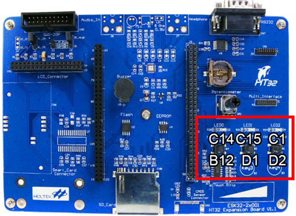

## GPIO
<!--table of content-->
<hr>
<table>
<tr></tr>
<th>第一週<br>第二週</th>
<th>第三週</th>
<th>第四週</th>
<th>第五週</th>
<th>第六週</th>
<th>第七週</th>
<th rowspan="2">期<br>中<br>考</th>
<th>第九週</th>
<th>第十週</th>
<th>...</th>
</tr>
<tr>
<td><p align="center"><a href="">README</a></p></td>
<td><p align="center"><a href="">CKCU</a></p></td>
<td>
<table><tr><td>

### GPIO / AFIO
&nbsp;&nbsp;&nbsp;&#9679;&nbsp;&nbsp;[簡單介紹](#簡單介紹)<br>
&nbsp;&nbsp;&nbsp;&nbsp;&nbsp;&nbsp;&nbsp;1.&nbsp;&nbsp;[設定方式](#1-設定方式)<br>


&nbsp;&nbsp;&nbsp;&#9679;&nbsp;&nbsp;[詳細講解](#詳細講解)<br>
</td></tr></table>
</td>
<td><p align="center"><a href="">EXTI<br>NVIC</a></p></td>
<td><p align="center"><a href="">BFTM</a></p></td>
<td><p align="center"><a href="">GPTM<br>MCTM</a></p></td>
<td><p align="center"><a href="">ADC</a></p></td>
<td><p align="center"><a href="">I&#0178;C<br>EEPROM</a></p></td>
<td>&nbsp;&nbsp;...&nbsp;&nbsp;</td>
</tr>
</table>
<hr>
<!--/table of content-->
<br>
<h2 align="center"><code>簡單介紹</code></h2>

### 1. 設定方式
通常範例程式裡面為了排版較好閱讀會將 GPIO 的設定移至成獨立的一個副函式名為 `GPIO_Configuration`。和 [CKCU 的設定](https://www.github.com/a2902793/MCU_Experiment/blob/master/1.%20原理講解/CKCU.md#1-設定方式) 稍不同的是，只有少數必要的 GPIO 腳位會是原先預設啟用的其餘都是未設定的，所以一樣也是 **需要用到什麼再開什麼**。
```c
void GPIO_Configuration(void)
{
  /* 如果是要設定 LED 燈的話，一定要包含下面這兩組設定 (以下舉 C14 也就是最左邊的 LED 燈為例) */
  AFIO_GPxConfig(GPIO_PC, AFIO_PIN_14, AFIO_FUN_GPIO);
  GPIO_DirectionConfig(HT_GPIOC, AFIO_PIN_14,GPIO_DIR_OUT);
	
  /* 如果是要設定按鈕的話，一定要包含下面這四組設定 (以下舉 B12 也就是最左邊的按鈕為例) */
  AFIO_GPxConfig(GPIO_PB, AFIO_PIN_12, AFIO_FUN_GPIO);
  GPIO_DirectionConfig(HT_GPIOB, AFIO_PIN_12,GPIO_DIR_OUT);
  GPIO_PullResistorConfig(HT_GPIOB, GPIO_PIN_12, GPIO_PR_DISABLE);
  GPIO_InputConfig(HT_GPIO_B, AFIO_PIN_12, AFIO_FUN_ENABLE);
}
```

<table>
<tr>
<td>

這裡在設定時如果你是用學校的板子 ([`ESK32-30501 入門套件`](https://www.holtek.com.tw/esk32-30501) + [`ESK32-20001 擴充板`](https://www.holtek.com.tw/ESK32-20001)) 的話，腳位是已經幫你設定好的。
<h6 align="center">

|   | 左 | 中 | 右 |
|---|---|---|---|
| LED | C14 | C15 | C1 |
| 按鈕 | B12 | D1 | D2 |
<h6>
</td>
<td>

</td>
</tr>
</table>

<br><br><br><br>

<br><br>
<h2 align="center"><code>詳細講解</code></h2>

