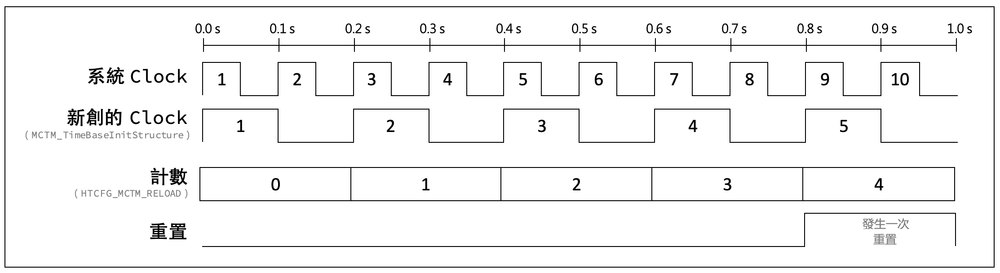
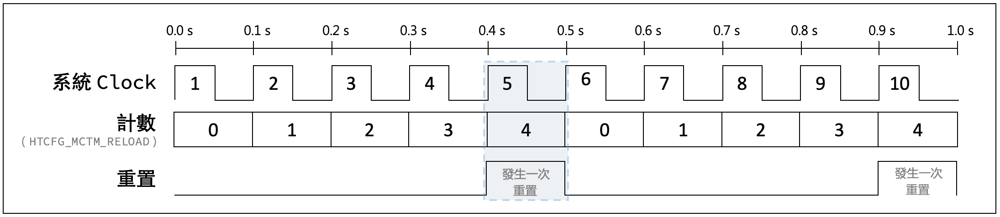
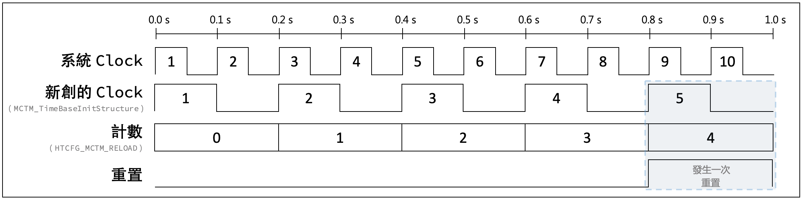
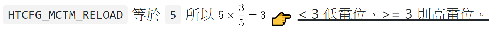
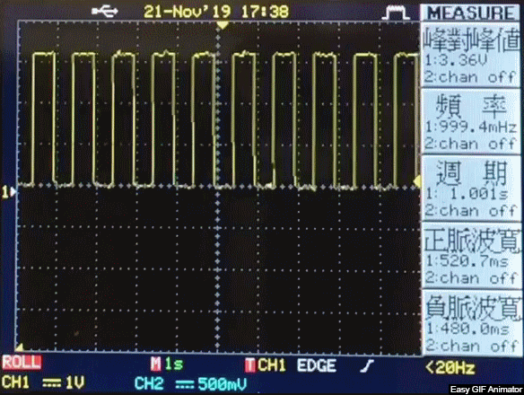
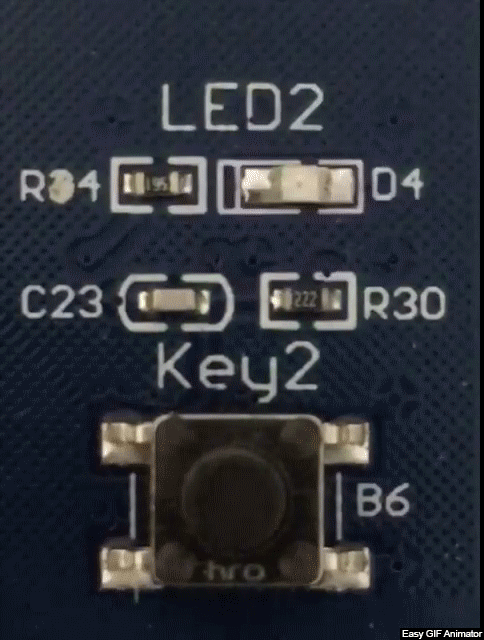
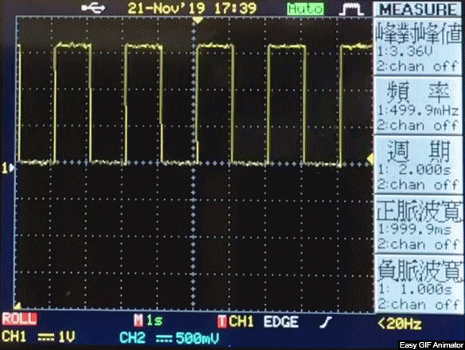

<h2 align="center"><code>原理講解</code></h2>
 

## MCTM

<table>
<tr>
<td>
  1
</td>
<td>
 
  假設系統是一個 `10Hz` 的時鐘，也就是說一秒會有 10 個脈波。
</td>
<td>

</td>
</tr>
<tr>
<td>
  2
</td>
<td>
	
  有一個計數器叫 `HTCFG_MCTM_RELOAD`
   
  其值等於 `5`，也就是每一個脈波就計數一次、數五次 (0、1、2、3、4) 就重新計數
</td>
<td>

</td>
</tr>
<tr>
<td>
  3
</td>
<td>
 
  這個是重置的狀態，以這張圖為例表示發生了兩次重置（重新計數）。
</td>
<td>

</td>
</tr>
<tr>
<td>
  4
</td>
<td>
	
  所以系統時鐘、計數器、重置的情況疊在一起像這樣。
</td>
<td>

</td>
</tr>
</table>
 

———————&nbsp;&nbsp;&nbsp;&nbsp;&nbsp;&nbsp;到這裡都還能理解吧？上面有看懂再往下看&nbsp;&nbsp;&nbsp;&nbsp;&nbsp;&nbsp;———————

 
<table>
<tr>
<td>
  5
</td>
<td>
	
  MCTM 裡面有個很重要的變數叫 `prescalar` 是用來除頻，換句話說就是 `頻率除以某數` 來調整 Clock 一秒數幾次。
   
  
  原先 Clock 一秒數 `10次`，今天你新創了一個 Clock 想要一秒數 `5次`，就把 `prescalar` 設成 `2`，新的頻率就會是 `10/prescalar次` `prescalar=2`。
</td>
<td>

 

  :mega: 注意哦～計數器沒變，仍然是 `一個脈波數一次，數5次就重置`
</td>
</tr>
<tr>
<th rowspan="4">
  6
</th>
<td rowspan="4">
比較一下兩者的不同，同樣都是
  

<code>一個脈波數一次，數5次就重置</code>

 

</td>
<th>	
系統 Clock
</th>
</tr>
<tr>
<td>

</td>
</tr>
<tr>
<th>
Prescalar=2 的 Clock
</th>
</tr>
<tr>
<td>

</td>
</tr>
<tr>
</tr>
<tr>
<td>
  7
</td>
<td>
	
  最後一個要理解的功能是 `Compare` 也就是一個比較值，它會跟計數器比較：
 

<code>小於則低電位、大於等於則高電位</code>

</td>
<td>
  

</td>
</tr>
<tr>
<td>
  8
</td>
<td>
	
  實際情況是：  
  * 系統時鐘 `48MHz`  
  * 計數器 (`HTCFG_MCTM_RELOAD`) = 48MHz/2000 = `24000`  
  * `Compare` 是設成 `1/2`，也就是一半的時間 High、一半的時間 Low
</td>
<td>

</td>
</tr>
</table>

 

<table>
<tr>
<th>
Prescaler
</th>
<th>
換算秒數
</th>
<th>
實際影像
</th>
<th>
波形圖
</th>
</tr>
<tr>
<th>
1000
</th>
<th>
0.5 秒
</th>
<td>

</td>
<td>

</td>
</tr>
<tr>
<th>
2000
</th>
<th>
1 秒
</th>
<td>

</td>
<td>

</td>
</tr>
<tr>
<th>
4000
</th>
<th>
2 秒
</th>
<td>

</td>
<td>

</td>
</tr>
</table>
