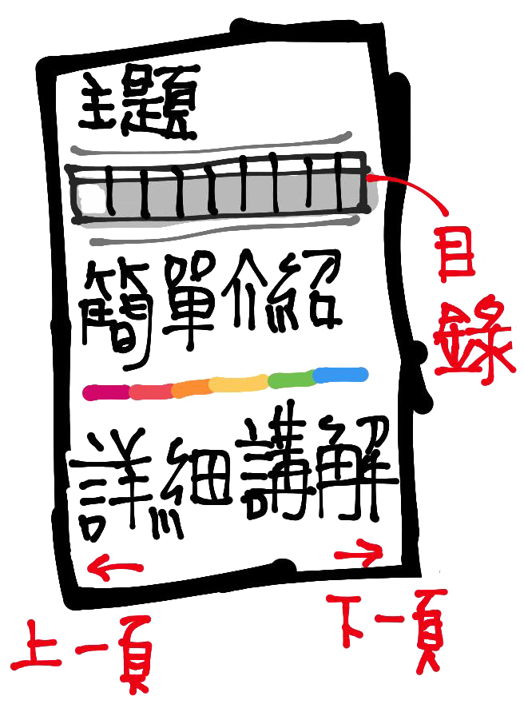
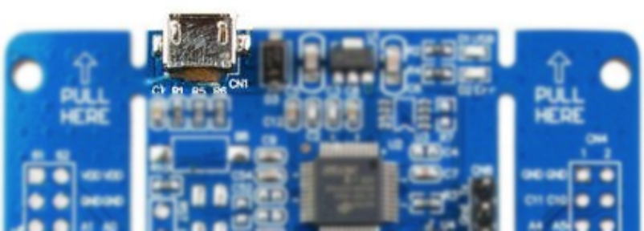

<h1 align="center">@TKUEE / 微處理機實驗</h1>

 

&nbsp;&nbsp;&nbsp;&nbsp;&nbsp;&nbsp;這個教學適用於淡江大學電機系三年級上學期微處理機實驗課（TETCB3B-0956）的同學以及那些想了解此塊開發板的人，其觀念 ***適用於其他微處理器*** 所以建議除了把上課內容弄懂之外，有時間的話也點進去各個功能去深入了解它們的原理與程式碼的撰寫。 
&nbsp;&nbsp;&nbsp;&nbsp;&nbsp;&nbsp;這門課使用的是盛群半導體股份有限公司（Holtek）的 [`ESK32-30501 入門套件`](https://www.holtek.com.tw/esk32-30501) 搭載 [`ESK32-20001 擴充板`](https://www.holtek.com.tw/ESK32-20001) 做練習，其中 ESK32-30501 入門套件所使用的微處理器是 HT32F52352 ，是一顆採用 ARM Cortex-M0+ 核心的微處理器，內建多組計時器、兩個 I2C 、兩個 SPI 、兩個 USART 、兩個 UART 、 一個12位元 ADC 、 USB 、 I2S 、 EBI 
等，可針對許多外部裝置進行試驗和開發原型。由於課堂時間有限，所以不會把所有的功能都教完，實際有教到的才會寫在這個教學中，詳情請看目錄。 
 
* 有問題歡迎開 issue 問我
* 內容可能有不足的也歡迎成為 contributor
* 最後如果這個教學對你有幫助的話也別忘記給個星星哦～:star:
 

<b>題外話（點我）</b>

我自己也是透過寫這個教學的過程中，知道怎麼去看datasheet、從中看懂各暫存器的功能、透過反推範例程式碼知道怎麼把較底層的位元操作包成較高階、淺顯易懂的API，於是在這裡把我日以繼夜研究一個多的月心得寫成教學，希望能幫你們省下一點時間。不得不說，其實反推別人的程式碼中可以學習到很多業界工程師寫的程式碼裡面的巧思，除了看教學外也非常鼓勵各位也能自己反推一遍。我想爾後如果遇到一個新的微處理器也不會怕了，就是一樣的流程而已：<ins>查看datasheet → 選擇要使用的功能 → 將位元運算包成API → 撰寫主要邏輯程式</ins>。總而言之，如果日後對軟硬體整合或是想當嵌入式系統工程師的同學，把這門課弄懂、學好 <b>受．益．良．多</b> 啊！
 

 

<code>程式碼歸盛群半導體股份有限公司（Holtek）所有。</code>

 
<!--table of content-->

<table>
<tr></tr>
<th>第一週 第二週</th>
<th>第三週</th>
<th>第四週</th>
<th>第五週</th>
<th>第六週</th>
<th>第七週</th>
<th rowspan="2">期 中 考</th>
<th>第九週</th>
<th>第十週</th>
<th>...</th>
</tr>
<tr>
<td>
<table><tr><td>

### README
&nbsp;&nbsp;&nbsp;&#9679;&nbsp;&nbsp;[前情提要](#前情提要) 
&nbsp;&nbsp;&nbsp;&nbsp;&nbsp;&nbsp;&nbsp;1.&nbsp;&nbsp;[教學怎麼看？]() 
&nbsp;&nbsp;&nbsp;&nbsp;&nbsp;&nbsp;&nbsp;2.&nbsp;&nbsp;[準備環境](#2-準備環境) 
<!--  -->
&nbsp;&nbsp;&nbsp;&#9679;&nbsp;&nbsp;[範例介紹](#範例介紹) 
</td></tr></table>
</td>
<td>
<a href="">CKCU</a>
</td>
<td>
<a href="">GPIO AFIO</a>
</td>
<td>
<a href="">EXTI NVIC</a>
</td>
<td>
<a href="">BFTM</a>
</td>
<td>
<a href="">GPTM MCTM</a>
</td>
<td>
<a href="">ADC</a>
</td>
<td>
<a href="">I&#0178;C EEPROM</a>
</td>
<td>&nbsp;&nbsp;...&nbsp;&nbsp;</td>
</tr>
</table>

<!--/table of content-->
 
<h2 align="center"><code>前情提要</code></h2>

### 1. 教學怎麼看？
所有的頁面都會照下面的方式呈現，主要分四大部分：<b>主題</b>、<b>目錄</b>、<b>簡單介紹</b>、<b>詳細講解</b>，其內容如下。
 
<table>
<tr>
<th>
主 題
</th>
<td>
這裡會顯示目前的主題或功能名字，有時會有些描述。
</td>
<th rowspan="5">

</th>
</tr>
<tr>
<th>
目 錄
</th>
<td>
這個目錄會以白框標示目前在講第幾週、什麼功能及所有次標題。其他週的內容會被縮到剩功能名稱、沒辦法排版進頁面的標題會被 <code>...</code> 取代，點它就會跳到後面的內容。
</td>
</tr>
<tr>
<th>簡 單 介 紹</th>
<td>
這裡比較適合多數人觀看，適合那些想快速了解怎麼設定、使用這個板子的同學。它涵蓋了該功能的介紹及<u>逐行程式講解</u>，如果是只想過這次的期中、期末的話看這裡就足夠了。
</td>
<tr>
<td colspan="2">

 <code>以彩虹線隔開</code> 

</td>
<!-- 
</td>
</tr>
<tr>
<td>
 -->
</tr>
<tr>
<th>詳細講解</th>
<td>
這裡是給那些想深入知道背後原理、為什麼程式要這樣寫、為什麼參數要給那個...等等的人，會配合板子的 datasheet 從 <u>main.c</u> 回推到 <u>驅動函式庫</u> 、甚至部分會更深一步回推到 <u>組語檔</u> 來講解，再以記憶體視窗實際觀看暫存器的值來驗證講解的內容。  

&#128190;記憶體視窗怎麼看？ (點我) 

在講怎麼看記憶體視窗之前，如果不知道 Little-Endian 這個東西的同學，建議先閱讀一下<a href="https://www.github.com/a2902793/MCU_Experiment/blob/master/1.%20原理講解/Endian.md#1-設定方式">位元組順序</a>再跳回來看。以第三周時鐘控制器 (CKCU) 為例：

</td>
</tr>
</table>
 

###  2. 準備環境
a) 確認所需要的程式都已經安裝好，如果沒有的話可以參考上課 PPT 裡的步驟去下載檔案。  
<!-- ，我這裡也備份了 <a href="">Keil MDK</a> 和 <a href="4. 安裝檔/Holtek_F5xxx_Firmware.zip">Holtek 的範例程式</a> -->

b) 最常板子插上去沒反應的原因是：**你插錯洞了！:flushed:**  
&nbsp;&nbsp;&nbsp;&nbsp;注意一下 micro-usb 線是要插在兩側 PULL HERE 中間的那個接頭（只有這個接頭有燒錄功能） →
  
c) 開啟 `Keil uVision 5`，然後參考第一週投影片設置開發板的燒錄設定，確保以下設定都有做到，不然燒錄可能成功但板子不會有反應

* `Configure Flash Tools...` > `Debug` > `Use`：確認為 `CMSIS-DAP Debugger`
* `Configure Flash Tools...` > `Debug` > `Settings` > `Flash Download`：`Reset and Run` 是打勾的
<!-- * `Configure Flash Tools...` > `C/C++` > `Optimization`：下拉選單選取 `Level 0 (-O0)` 
&#9757; 這個步驟可座可不做，它的用處是調整最佳化的程度，0 即無最佳化。如果會看詳細講解的話建議設定**無最佳化**。 -->
 

d) 再依照題目選一範例進行修改
<table>
<tr>
<td>
  
  所有程式碼都改自官方提供的範例程式，不同範例存在不同資料夾內。 
  學校的是在下面的路徑內，也可以使用你從<a href="https://www.holtek.com.tw/documents/10179/aa47cbc8-7203-4c7c-b311-3815080cbb2b">官網</a>或<a href="安裝檔/Holtek_F5xxx_Firmware.zip">我的備份</a>下載、解壓縮的資料夾。實際路徑可能有些許不同，但基本上如果沒有更改資料夾名字的話都是在 `HT32_STD_5xxxx_FWLib_v011_4188` 資料夾內，演示如右。
</td>
<td>

</td>
</tr>
<tr>
<td colspan="2">

  `C:\Holtek\HT32_STD_5xxxx_FWLib_v011_4188\example`
</td>
</tr>
</table>

e) 點進所想要使用的範例程式後，執行 `_CreateProject.bat`，它會自動幫你生成所需要的專案和程式碼。

<table cellspacing="12">
<tr>
<td td colspan=4>
  
  這裡以 `GPIO` 的 `InputOutput` 為例（拿到一個新板子可以燒錄這個範例來測試板子 LED、GPIO 是否正常），等執行完後會生出很多檔案和資料夾，進到 `MDK_ARMv5` 資料夾並執行 `Project_52352.uvprojx` ，演示和路徑如右。
</td>
<td td colspan=8>

</td>
</tr>
<tr>
<td colspan=12>

  `C:\Holtek\HT32_STD_5xxxx_FWLib_v011_4188\example\GPIO\InputOutput\MDK_ARMv5\Project_52352.uvprojx`
</td>
</tr>
</table>
 
 

 
<h2 align="center"><code>範例介紹</code></h2>

|範例|功能|
|---|---|
|GPIO|General Purpose Input/Output (GPIO) 代表通用型之輸入輸出，功能是基本高低電位的輸入輸出|
|MCTM|Motor Control Timer (MCTM) 代表馬達控制計時器，可用於多種用途，包括通用計時、測量輸入信號脈衝寬度或產生輸出波形，如單脈衝或 PWM 輸出。|
 

<a href="https://github.com/a2902793/MCU_Experiment/blob/master/1.%20原理講解/CKCU.md"><b>開始閱讀吧！ &#128073; CKCU&nbsp;</b></a>
