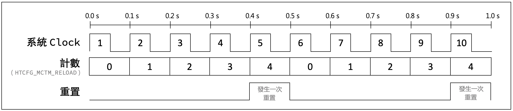

# 微處理機實驗考試
這個教學只適用於108學年第1學期微處理機實驗課的期中考，所使用的板子型號是HT32F52352。
 
 
 
&nbsp;&nbsp;&nbsp;&nbsp;&nbsp;&nbsp;&nbsp;&nbsp;&nbsp;&nbsp;&nbsp;&nbsp;&nbsp;&nbsp;&nbsp;&nbsp;&nbsp;&nbsp;&nbsp;&nbsp;&nbsp;&nbsp;&nbsp;&nbsp;&nbsp;&nbsp;&nbsp;&nbsp;&nbsp;&nbsp;&nbsp;&nbsp;&nbsp;&nbsp;&nbsp;&nbsp;&nbsp;&nbsp;&nbsp;&nbsp;&nbsp;&nbsp;&nbsp;&nbsp;&nbsp;&nbsp;&nbsp;&nbsp;&nbsp;&nbsp;&nbsp;&nbsp;&nbsp;&nbsp;&nbsp;&nbsp;&nbsp;&nbsp;&nbsp;&nbsp;&nbsp; `程式碼歸盛群半導體股份有限公司（Holtek）所有。`

 
 

## &nbsp;&nbsp;&nbsp;&nbsp;&nbsp;&nbsp;&nbsp;&nbsp;&nbsp;&nbsp;&nbsp;&nbsp;&nbsp;&nbsp;&nbsp;&nbsp;&nbsp;&nbsp;&nbsp;&nbsp;&nbsp;&nbsp;&nbsp;&nbsp;&nbsp;&nbsp;&nbsp;&nbsp;&nbsp;&nbsp;&nbsp;&nbsp;&nbsp;&nbsp;&nbsp;&nbsp;&nbsp;&nbsp;&nbsp;&nbsp;&nbsp;&nbsp;&nbsp;&nbsp;&nbsp;&nbsp;&nbsp;&nbsp;&nbsp;&nbsp;&nbsp;&nbsp;&nbsp; `前情提要`

###  1. 準備環境
a) 參考第一週投影片設置開發板的燒錄設定，確保以下設定都有做到，不然燒錄可能成功但板子不會有反應
* `Configure Flash Tools...` > `C/C++` > `Optimization`：下拉選單選取 `Level 0 (-O0)`
* `Configure Flash Tools...` > `Debug` > `Use`：確認為 `CMSIS-DAP Debugger`
* `Configure Flash Tools...` > `Debug` > `Settings` > `Flash Download`：`Reset and Run` 是打勾的

b) 再依照題目選一範例進行修改
<table>
<tr>
<td>
  
  所有程式碼都改自官方提供的範例程式，不同範例存在不同資料夾內。基本上都存在下面的路徑內，實際路徑可能有些許不同，但都是在 `C:\Holtek\` 資料夾內。
</td>
<td>

</td>
</tr>
<tr>
<td colspan="2">

  `C:\Holtek\HT32_STD_5xxxx_FWLib_v011_4188\example`
</td>
</tr>
</table>

c) 點進所想要使用的範例程式後，執行 `_CreateProject.bat`，它會自動幫你生成所需要的專案和程式碼。

<table cellspacing="12">
<tr>
<td td colspan=4>
  
  這裡以 `GPIO` 的 `InputOutput` 為例（如果只需要控制按鈕跟LED，修改這個範例就可以了），等執行完後會生出很多檔案和資料夾，進到 `MDK_ARMv5` 資料夾並執行 `Project_52352.uvprojx` ，演示和路徑如下。
</td>
<td td colspan=8>

</td>
</tr>
<tr>
<td colspan=12>

  `C:\Holtek\HT32_STD_5xxxx_FWLib_v011_4188\example\GPIO\InputOutput\MDK_ARMv5\Project_52352.uvprojx`
</td>
</tr>
</table>

 

### 2. 思考步驟
1. 需要用到什麼元件？
2. 怎麼用？
3. 在main裡寫邏輯

 

### 3. 範例介紹

|範例|功能|
|---|---|
|GPIO|General Purpose Input/Output (GPIO) 代表通用通用型之輸入輸出，功能是基本高低電位的輸入輸出|
|MCTM|Motor Control Timer (MCTM) 代表馬達控制計時器，可用於多種用途，包括通用計時、測量輸入信號脈衝寬度或產生輸出波形，如單脈衝或 PWM 輸出。|

 

### 4. 基本程式碼講解
有些程式碼是開發版的基本設定，基本上每個自動生出來的範例裡面都有。基本上呢 ... 這些不會是你需要動到，也不太需要了解的（如果只是想應付這次考試的話可以直接跳到考題講解:smirk:） 
也就是 `GPIO_PC, AFIO_PIN_1` 。往後的腳位都是用這個方法設定，也就是 GPIO 在前、AFIO 在後，為了講解方便 GPIO_P`C`, AFIO_PIN_`1`就簡稱 `C1`。 
 
 
 

## &nbsp;&nbsp;&nbsp;&nbsp;&nbsp;&nbsp;&nbsp;&nbsp;&nbsp;&nbsp;&nbsp;&nbsp;&nbsp;&nbsp;&nbsp;&nbsp;&nbsp;&nbsp;&nbsp;&nbsp;&nbsp;&nbsp;&nbsp;&nbsp;&nbsp;&nbsp;&nbsp;&nbsp;&nbsp;&nbsp;&nbsp;&nbsp;&nbsp;&nbsp;&nbsp;&nbsp;&nbsp;&nbsp;&nbsp;&nbsp;&nbsp;&nbsp;&nbsp;&nbsp;&nbsp;&nbsp;&nbsp;&nbsp;&nbsp;&nbsp;&nbsp;&nbsp;&nbsp;&nbsp; `原理講解`

 
 

## MCTM
<table>
<tr>
<td>
  1
</td>
<td>
 
  假設系統是一個 `10Hz` 的時鐘，也就是說一秒會有 10 個脈波。
</td>
<td>

</td>
</tr>
<tr>
<td>
  2
</td>
<td>
	
  有一個計數器叫 `HTCFG_MCTM_RELOAD`
   
  其值等於 `5`，也就是每一個脈波就計數一次、數五次 (0、1、2、3、4) 就重新計數
</td>
<td>

</td>
</tr>
<tr>
<td>
  3
</td>
<td>
 
  這個是重置的狀態，以這張圖為例表示發生了兩次重置（重新計數）。
</td>
<td>

</td>
</tr>
<tr>
<td>
  4
</td>
<td>
	
  所以系統時鐘、計數器、重置的情況疊在一起像這樣。
</td>
<td>

</td>
</tr>
</table>
 

———————&nbsp;&nbsp;&nbsp;&nbsp;&nbsp;&nbsp;到這裡都還能理解吧？上面有看懂再往下看&nbsp;&nbsp;&nbsp;&nbsp;&nbsp;&nbsp;———————

 
<table>
<tr>
<td>
  5
</td>
<td>
	
  MCTM 裡面有個很重要的變數叫 `prescalar` 是用來除頻，換句話說就是 `頻率除以某數` 來調整 Clock 一秒數幾次。
   
  
  原先 Clock 一秒數 `10次`，今天你新創了一個 Clock 想要一秒數 `5次`，就把 `prescalar` 設成 `2`，新的頻率就會是 `10/prescalar次` `prescalar=2`。
</td>
<td>

 

  :mega: 注意哦～計數器沒變，仍然是 `一個脈波數一次，數5次就重置`
</td>
</tr>
<tr>
<th rowspan="4">
  6
</th>
<td rowspan="4">

比較一下兩者的不同，同樣都是

	
  &nbsp;&nbsp;&nbsp;&nbsp;&nbsp;&nbsp;&nbsp;&nbsp;`一個脈波數一次，數5次就重置`
   
   
  &nbsp;&nbsp;&nbsp;&nbsp;&nbsp;&nbsp;&nbsp;&nbsp;&nbsp;&nbsp;&nbsp;&thinsp;&thinsp;`系統 Clock` 數5次： `0.5秒` 
   
  `prescalar=2 Clock` 數5次： `1秒鐘`
</td>
<th>	
系統 Clock
</th>
</tr>
<tr>
<td>

</td>
</tr>
<tr>
<th>
Prescalar=2 的 Clock
</th>
</tr>
<tr>
<td>

</td>
</tr>
<tr>
</tr>
<tr>
<td>
  7
</td>
<td>
	
  最後一個要理解的功能是 `Compare` 也就是一個比較值，它會跟計數器比較：
   
  
  &nbsp;&nbsp;&nbsp;&nbsp;&nbsp;`小於則低電位、大於等於則高電位`
</td>
<td>
  

</td>
</tr>
<tr>
<td>
  8
</td>
<td>
	
  &nbsp;&nbsp;&nbsp;&nbsp;實際情況是：系統時鐘 `48MHz`
  &nbsp;&nbsp;&nbsp;&nbsp;計數器也就是 ( `HTCFG_MCTM_RELOAD` ) = 48MHz/2000 = `24000`
  &nbsp;&nbsp;&nbsp;&nbsp;`Compare` 是設成 `1/2`，也就是一半的時間 High、一半的時間 Low
</td>
<td>

</td>
</tr>
</table>

