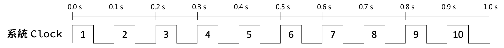

<h1 align="center">@TKUEE / 微處理機實驗</h1>

 

&nbsp;&nbsp;&nbsp;&nbsp;&nbsp;&nbsp;這個教學適用於淡江大學電機系三年級上學期微處理機實驗課（TETCB3B-0956）的同學以及那些想了解此塊開發板的人，其觀念 ***適用於其他微處理器*** 所以建議除了把上課內容弄懂之外，有時間的話也點進去各個功能去深入了解它們的原理與程式碼的撰寫。 
&nbsp;&nbsp;&nbsp;&nbsp;&nbsp;&nbsp;這門課使用的是盛群半導體股份有限公司（Holtek）的 `ESK32-30501 入門套件` 搭載 `ESK32-20001 擴充板` 做練習，其中 ESK32-30501 入門套件所使用的微處理器是 HT32F52352 ，是一顆採用 ARM Cortex-M0+ 核心的微處理器，內建多組計時器、兩個 I2C 、兩個 SPI 、兩個 USART 、兩個 UART 、 一個12位元 ADC 、 USB 、 I2S 、 EBI 
等，可針對許多外部裝置進行試驗和開發原型。由於課堂時間有限，所以不會把所有的功能都教完，實際有教到的才會寫在這個教學中，詳情請看目錄。 
 
有問題歡迎開 issue 問我、內容可能有不足的也歡迎成為 contributor、最後如果這個教學對你有幫助的話也別忘記給個星星哦～:star:
 

題外話（點我）

我自己也是透過寫這個教學的過程中，知道怎麼去看datasheet、從中看懂各暫存器的功能、透過反推範例程式碼知道怎麼把較底層的位元操作包成較高階、淺顯易懂的API，於是在這裡把我日以繼夜研究一個多的月心得寫成教學，希望能幫你們省下一點時間。不得不說，其實反推別人的程式碼中可以學習到很多業界工程師寫的程式碼裡面的巧思，除了看教學外也非常鼓勵各位也能自己反推一遍。我想爾後如果遇到一個新的微處理器也不會怕了，就是一樣的流程而已：<ins>查看datasheet → 選擇要使用的功能 → 將位元運算包成API → 撰寫主要邏輯程式</ins>。總而言之，如果日後對軟硬體整合或是想當嵌入式系統工程師的同學，把這門課弄懂、學好 <b>受．益．良．多</b> 啊！
 

 
 

<code>程式碼歸盛群半導體股份有限公司（Holtek）所有。</code>

 
 

<h2>目錄</h2>

<!--ts-->
- [前情提要](#前情提要)
    1. [準備環境](#1-準備環境)
    2. [思考步驟](#2-思考步驟)
    3. [範例介紹](#3-範例介紹)
    4. [基本程式碼講解](#4-基本程式碼講解)
- [原理講解](#原理講解)
    - [MCTM](#mctm)
<!--te-->

 

 
 

<h2 align="center"><code>前情提要</code></h2>

###  1. 準備環境
a) 確認所需要的程式都已經安裝好，如果沒有的話可以參考上課PPT裡的步驟去下載檔案，我這裡也備份了 <a href="安裝檔/mdk528a.exe">Keil MDK</a> 和 <a href="安裝檔/Holtek_F5xxx_Firmware.zip">Holtek 的範例程式</a>。 

a) 參考第一週投影片設置開發板的燒錄設定，確保以下設定都有做到，不然燒錄可能成功但板子不會有反應
* `Configure Flash Tools...` > `C/C++` > `Optimization`：下拉選單選取 `Level 0 (-O0)`
* `Configure Flash Tools...` > `Debug` > `Use`：確認為 `CMSIS-DAP Debugger`
* `Configure Flash Tools...` > `Debug` > `Settings` > `Flash Download`：`Reset and Run` 是打勾的

b) 再依照題目選一範例進行修改
<table>
<tr>
<td>
  
  所有程式碼都改自官方提供的範例程式，不同範例存在不同資料夾內。基本上都存在下面的路徑內，實際路徑可能有些許不同，但都是在 `C:\Holtek\` 資料夾內，演示和路徑如右。
</td>
<td>

</td>
</tr>
<tr>
<td colspan="2">

  `C:\Holtek\HT32_STD_5xxxx_FWLib_v011_4188\example`
</td>
</tr>
</table>

c) 點進所想要使用的範例程式後，執行 `_CreateProject.bat`，它會自動幫你生成所需要的專案和程式碼。

<table cellspacing="12">
<tr>
<td td colspan=4>
  
  這裡以 `GPIO` 的 `InputOutput` 為例（如果只需要控制按鈕跟LED，修改這個範例就可以了），等執行完後會生出很多檔案和資料夾，進到 `MDK_ARMv5` 資料夾並執行 `Project_52352.uvprojx` ，演示和路徑如右。
</td>
<td td colspan=8>

</td>
</tr>
<tr>
<td colspan=12>

  `C:\Holtek\HT32_STD_5xxxx_FWLib_v011_4188\example\GPIO\InputOutput\MDK_ARMv5\Project_52352.uvprojx`
</td>
</tr>
</table>

 

### 2. 思考步驟
1. 需要用到什麼元件？
2. 怎麼用？
3. 在main裡寫邏輯

 

### 3. 範例介紹

|範例|功能|
|---|---|
|GPIO|General Purpose Input/Output (GPIO) 代表通用型之輸入輸出，功能是基本高低電位的輸入輸出|
|MCTM|Motor Control Timer (MCTM) 代表馬達控制計時器，可用於多種用途，包括通用計時、測量輸入信號脈衝寬度或產生輸出波形，如單脈衝或 PWM 輸出。|

 

### 4. 基本程式碼講解
有些程式碼是開發板的基本設定，基本上每個自動生出來的範例裡面都有。基本上呢 ... 這些不會是你需要動到，也不太需要了解的（如果只是想應付這次考試的話可以直接跳到考題講解:smirk:） 
<del>也就是 `GPIO_PC, AFIO_PIN_1` 。往後的腳位都是用這個方法設定，也就是 GPIO 在前、AFIO 在後，為了講解方便 GPIO_P`C`, AFIO_PIN_`1`就簡稱 `C1`。</del>
 
 
 

 
 

<h2 align="center"><code>原理講解</code></h2>

 

## MCTM

<table>
<tr>
<td>
  1
</td>
<td>
 
  假設系統是一個 `10Hz` 的時鐘，也就是說一秒會有 10 個脈波。
</td>
<td>

</td>
</tr>
<tr>
<td>
  2
</td>
<td>
	
  有一個計數器叫 `HTCFG_MCTM_RELOAD`
   
  其值等於 `5`，也就是每一個脈波就計數一次、數五次 (0、1、2、3、4) 就重新計數
</td>
<td>

</td>
</tr>
<tr>
<td>
  3
</td>
<td>
 
  這個是重置的狀態，以這張圖為例表示發生了兩次重置（重新計數）。
</td>
<td>

</td>
</tr>
<tr>
<td>
  4
</td>
<td>
	
  所以系統時鐘、計數器、重置的情況疊在一起像這樣。
</td>
<td>

</td>
</tr>
</table>
 

———————&nbsp;&nbsp;&nbsp;&nbsp;&nbsp;&nbsp;到這裡都還能理解吧？上面有看懂再往下看&nbsp;&nbsp;&nbsp;&nbsp;&nbsp;&nbsp;———————

 
<table>
<tr>
<td>
  5
</td>
<td>
	
  MCTM 裡面有個很重要的變數叫 `prescalar` 是用來除頻，換句話說就是 `頻率除以某數` 來調整 Clock 一秒數幾次。
   
  
  原先 Clock 一秒數 `10次`，今天你新創了一個 Clock 想要一秒數 `5次`，就把 `prescalar` 設成 `2`，新的頻率就會是 `10/prescalar次` `prescalar=2`。
</td>
<td>

 

  :mega: 注意哦～計數器沒變，仍然是 `一個脈波數一次，數5次就重置`
</td>
</tr>
<tr>
<th rowspan="4">
  6
</th>
<td rowspan="4">
比較一下兩者的不同，同樣都是
  

<code>一個脈波數一次，數5次就重置</code>

 

</td>
<th>	
系統 Clock
</th>
</tr>
<tr>
<td>

</td>
</tr>
<tr>
<th>
Prescalar=2 的 Clock
</th>
</tr>
<tr>
<td>

</td>
</tr>
<tr>
</tr>
<tr>
<td>
  7
</td>
<td>
	
  最後一個要理解的功能是 `Compare` 也就是一個比較值，它會跟計數器比較：
 

<code>小於則低電位、大於等於則高電位</code>

</td>
<td>
  

</td>
</tr>
<tr>
<td>
  8
</td>
<td>
	
  實際情況是：  
  * 系統時鐘 `48MHz`  
  * 計數器 (`HTCFG_MCTM_RELOAD`) = 48MHz/2000 = `24000`  
  * `Compare` 是設成 `1/2`，也就是一半的時間 High、一半的時間 Low
</td>
<td>

</td>
</tr>
</table>

 

<table>
<tr>
<th>
Prescaler
</th>
<th>
換算秒數
</th>
<th>
實際影像
</th>
<th>
波形圖
</th>
</tr>
<tr>
<th>
1000
</th>
<th>
0.5 秒
</th>
<td>

</td>
<td>

</td>
</tr>
<tr>
<th>
2000
</th>
<th>
1 秒
</th>
<td>

</td>
<td>

</td>
</tr>
<tr>
<th>
4000
</th>
<th>
2 秒
</th>
<td>

</td>
<td>

</td>
</tr>
</table>
